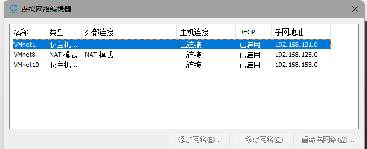

[toc]

# 内网渗透测试基础

## 基础知识

### 工作组

工作组可以自由进入和退出，方便同组的计算机相互访问。工作组没有集中管理的作用，所有计算机都是对等的。

### 域

- 域（Domain）
  - 有安全管理控制机制
  - 需要以合法身份登录
  - 不同身份有不同权限
- 域控制器（domain controller）
  - 通讯枢纽，所有的权限和身份验证都在域控上进行
  - 存储所属域计算机的账户，密码等信息，所有用来验证身份的账号和密码散列值都保存在域控制器中
- 单域
  - 至少两台域服务器，DC和备份DC
- 父域和子域
  - 第一个域为父域，其余称为该域的子域
  - 简化信息交互，便于管理
  - 每个域可以设置自己的安全策略
- 域树
  - 多个域通过建立信任关系组成的集合
  - 访问和管理其他域
  - `asia.abc.com` `abc.com`子域只能使用父域的名字作为域名后缀，域树中域名是连续的
- 域森林
  - 多个域树相互建立信任关系组成的集合
- 域名服务器（domain name server，dns）
  - 通过寻找DNS服务器来确定域控的位置

### 域控和活动目录

- 活动目录（Active Directory）
  - 用于查找，管理和使用网络中的资源对象
  - 活动目录（AD）安装在域控（DC）上

### 安全域的划分

- 内网	安全级别最高
  - 可以管理DMZ，访问外网
- 隔离区（DMZ）
  - 放置web服务器用于外网访问
  - DMZ不能访问内网，以提供保护
  - 入侵检测设备部署在DMZ
- 外网   

### 域中身份分类

- 域控制器
  - 可以设置多台域控共同工作
- 成员服务器（安装服务器系统，但没有安装AD的计算机）
- 客户机
- 独立服务器（没有加入域的服务器）

最简单的域只包含DC一台机器

### 域内权限

- 组（Group） 
  - 用户账户的集合
  - 简化网络维护和管理
- 域本地组 来自全林，作用于本域
  - 多域用户访问单域资源，用于本域内资源访问授权
- 全局组 来自本域，作用于全林
  - 单域用户访问多域资源，用于域森林任何域内授权
- 通用组 来自全林，作用于全林
  - 在域森林和跨域访问使用

- 常见域本地组权限
  - 管理员组 administrator 对本地AD和DC具有管理员权限，权限最高的组
- 常见全局组，通用组权限
  - 域管理员组 Domain Administrator  对域中所有机器包括DC和AD具有具有管理员权限
  - 域用户组 Domain Users 所有的域成员，默认建立的用户属于Domain Users组

### Windows Powershell基础

在windows7以上的系统中默认安装

~~~
get-host //查看版本
Get-ExecutionPolicy //查看脚本执行策略 默认为Restricted 不允许运行
Get-ExecutionPolicy <policy name> //更改执行策略
~~~

后渗透ps脚本  https://github.com/PowerShellMafia/PowerSploit

power shell教程 https://www.pstips.net/powershell-introduction-and-install.html

~~~
//本地绕过执行策略执行脚本
powershell.exe -ExecutionPolicy Bypass -File .\powerup.ps1
 powershell.exe -exec bypass -Command "&{Import-Module C:\powerup.ps1;Invoke-AllChecks
 }"
~~~

## 构建内网环境

### 搭建域环境

- windows server 2012 R2
- windows server 2008 R2
- windows 7

虚拟机安装过程省略，在配置网络时选择nat或仅主机模式，一定要把三台主机接入同一个虚拟网络。我这里都接入VMnet10。

#### windows server 2012 R2

1. 配置网络

2. 更改计算机名，需要重启

3. 安装域控制器和DNS服务，服务器管理器仪表盘--添加角色和功能--基于角色或功能的安装--服务器选择--服务器角色（勾选active directory域服务 和 dns服务器）

功能默认--确认（勾选自动重启服务器）--安装

4. 升级服务器

部署配置--添加新林，根域名hacke.testlab，设置密码（密码要符合强度）

不用理会dns选项中的警告，直接下一步，netBIOS域名保持默认，路径默认，本地管理员账户要设置好密码，否则先决条件检查会报错。最后点击安装，重启服务器

使用 HACKE\Administrator的密码登录，登录后在服务器管理中就可以看到AD和DNS服务器了。

5. 创建Active Directory账户

控制面板--系统和安全--管理工具--Active Directory用户和计算机

域账户可以域内任意主机登录

#### windows server 2008

1. 设置网络

2. 更改计算机名和域名

输入域管理员administrator的密码

重启后，使用本地账户，或域账户都能登录。

windows7主机同理

~~~
目前有三种账户
本地账户：可用于本机登录  win7test winserver2012 winserver2008
域管理员账户：Administrator
域账户：可以在任意域内主机（除域控）登录 usertest 
~~~

在域控上可以看到加入域的计算机，还可以对其进行管理（添加用户，创建计划任务等）

> 域环境刚刚搭建好，只有ping域控是通的，win7和2008不同，这是防火墙的原因，把防火墙关闭就好了

### 域内主机配置双网卡访问外网

域内主机的DNS服务器设置为域控，这样一来就无法访问外网了。此时可以通过配置双网卡访问外网。

以win7为例，在虚拟机设置--硬件--添加，选择网络适配器。添加一块新网卡即可，类型可选NAT或桥接。

最终我搭建内网靶场网络情况如下

~~~
域控：winserver2012  内网ip 192.168.10.1
winserver2008 内网ip 192.168.10.3
win7 （web服务器，被攻击端） 内网ip 192.168.10.4 外网ip 192.168.31.127
win10宿主机ip 192.168.31.88（可作为攻击端）
~~~

